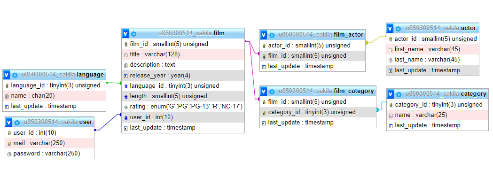

# Sakila
Durant aquesta prova es durà a terme el desenvolupament d’una aplicació per un videoclub que consisteix en una pàgina de lloguer de pel·lícules, el resultat de la seva execució es pot veure a la següent URL:
 
https://dawsonferrer.com/allabres/mvc/sakila/Controllers/filmsController.php
  
Tal com es pot observar disposem d’una pàgina de login, el següent usuari ha sigut creat per defecte. email: prova, password: prova.
 
https://dawsonferrer.com/allabres/mvc/sakila/Controllers/loginController.php
  
A banda de la pagina de login disposem d’una pàgina de signup que permet crear nous usuaris.
 
https://dawsonferrer.com/allabres/mvc/sakila/Controllers/signUpController.php
  
Finalment disposem d'un controlador sense vista per tal de fer logout:
 
https://dawsonferrer.com/allabres/mvc/sakila/Controllers/logoutController.php
  
La base de dades presenta la següent estructura:

*PRESTAR ESPECIAL ATENCIÓ A MAJÚSCULES I MINÚSCULES
  
Tal com es pot observar a la base de dades, la taula més important és la de film, on podem trobar el codi de cada pel·lícula, el seu títol, la seva descripció, el seu usuari (usuari que ha llogat la pel·lícula, per defecte NULL), a més d'altres camps que mostrarà la nostra aplicació. Mentre que les altres taules són secundaries i estan relacionades directe o indirectament amb la taula de pel·lícules mitjançant claus foranies. La taula users és on nosaltres crearem els nostres usuaris, disposem ja d’un usuari de prova tal com s’ha explicat amb anterioritat (usuari creat amb la funció crypt) i que per defecte té llogada la pel·lícula Apache Divine.
 
Presteu especial atenció a les taules auxiliars film_actor i film_category que s'empren per crear una relació n-n.
  
Per tal de llogar una pel·lícula, només cal fer un UPDATE a la taula film i introduir el valor de l'usuari que ha llogat la pel·lícula, mentre que per retornar una pel·lícula simplement cal tornar a establir aquest camp a NULL. <strong>NO CAL MODIFICAR L'ESTRUCTURA DE LA BASE DE DADES!</strong>
  
Per tal d'optimitzar la vostra aplicació podeu posar un limitador a la vostra consulta SQL de tal forma que us retorni únicament 20 pel·lícules aleatòries, un exemple de consulta seria:
 
<strong>SELECT * FROM film ORDER BY RAND(1234) LIMIT 20;</strong>
  
Un cop es crea un usuari ja es pot iniciar sessió i anar a la pàgina del llistat de pel·lícules, on podrem llogar i retornar pel·lícules i haurem de desenvolupar la funcionalitat de l'aplicació.
  
Per tal de dur a terme aquest examen podeu emprar els manuals oficials de PHP i de MySQL així com fer ús de tots els recursos disponibles a la web de W3Schools.
  
P.S.: Aneu per parts, primer importeu la base de dades, després creeu l'estructura de classes, properament passeu a implementar cada pàgina en MVC, aneu pàgina a pàgina, no cal fer consultes complexes en els models, un mateix problema sempre pot ser desglossat en problemes més petits i anar resolent un a un. No abandoneu abans d'hora, <strong style="color:darkred;">gestioneu la frustració</strong> i cerqueu solucions alternatives quan alguna cosa no surti. Ànims i molta sort.